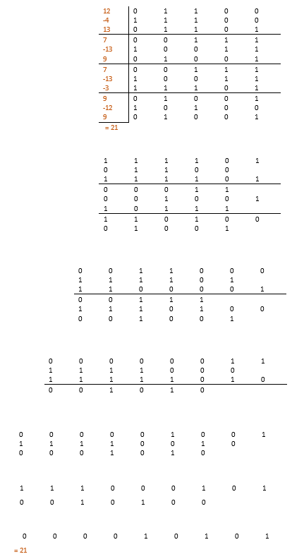

# Wallace Tree Adder
Generates a Verilog implementation of a Wallace tree of 3-2 carry save adders using two configuration parameters: number of operands and their bit-length.
Generated Verilog is saved in the resulting .txt files. Script for generation is written in Python (languages have a similar array syntax)
Validation of the generated tree is two-fold. First validation is done in Python code itself (since the syntax is so similar) and other is done using the generated Verilog testbench.

## Content

1. What is a Wallace tree of 3-2 carry save adders?
2. How to get your own Wallace tree of 3-2 carry save adders?
3. How to get the testbench code?

### 1. What is a Wallace tree of 3-2 carry save adders?

This adder implementation is inspired by the Wallace multiplier ([wiki article](https://en.wikipedia.org/wiki/Wallace_tree)) and has similar space, time requirements.

First you need to know how a Wallace multiplier ([youtube video](https://www.youtube.com/watch?v=4-l_PGPog9o&t=96s)) works.
The only difference between these two algorithms is that instead of the partial products you have individual operands in the rows, and they are all aligned to to right at the start (note the order of bits MSB -> LSB).

And those five steps (where the number of operands is greater than two) each have the time delay of one full-adder circuit. So the last addition is the slower part of the circuit.

### 2. How to get your own Wallace tree of 3-2 carry save adders?

1. Install python 3+
2. Install python packages: numpy and pandas
3. Go to project directory and run: **python3 wallace_tree \<number of operands> <operand's bit-length>**
4. Get your Verilog code from the wallace_tree.txt

### 3. How to get the testbench code?
1. Go to project directory and run: **python3 wallace_testbench \<number of operands> <operand's bit-length>**
2. Get the testbench code from wallace_testbench.txt
